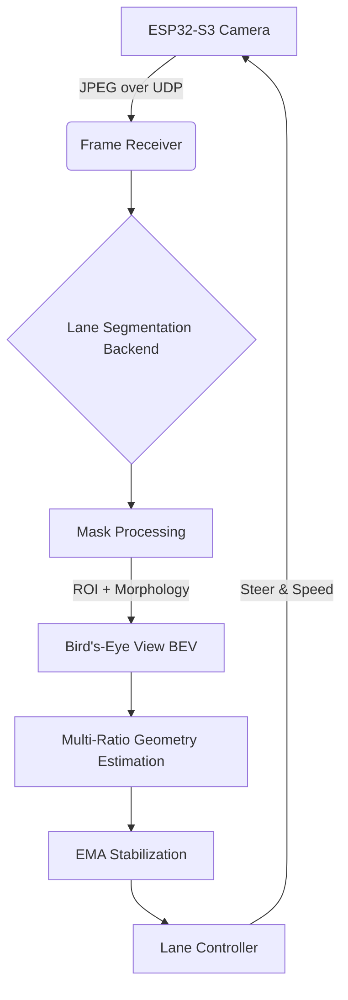

# AutoCar-LaneKeeping

### A Modular Real-Time Lane Keeping and Benchmarking Framework for Miniature Autonomous Vehicles


> **Team Members:**
> * Phan Van Chuong
> * Nguyen Dinh Duong
> * Nguyen Van Truong
>
> **Mentor:**
> * AnhKD3 (Khuất Đức Anh)
>
> **Program:** Bachelor of Artificial Intelligence - FPT University

---

## 1. Project Overview

This project implements a **real-time lane keeping system** for a miniature autonomous vehicle (AutoCar-Kit). The system receives camera frames streamed over UDP from an ESP32-S3, performs lane segmentation using deep learning, estimates lane geometry in Bird’s-Eye View (BEV), and generates steering and speed commands for autonomous driving.

The project is developed as a graduation thesis, with emphasis on:
* **System-level design:** From perception → geometry → control.
* **Fair benchmarking:** Evaluation of multiple lane segmentation models.
* **Stability and robustness:** optimized for real-world indoor environments.
* **Reproducibility:** A framework for future research and teaching.

**Note:** This is a real deployment system, not a simulation.

## 2. Main Contributions

* **Modular Pipeline:** Model-agnostic lane-keeping architecture.
* **Robust Streaming:** UDP JPEG frame reassembly algorithm for ESP32.
* **Unified Processing:** Standardized post-processing and BEV projection for fair comparison.
* **Advanced Geometry:** Multi-ratio lane estimation with adaptive selection.
* **Stable Control:** EMA-based (Exponential Moving Average) stabilization for robust steering.
* **Analysis Tools:** Real-time visualization and CSV benchmark logging.

## 3. System Architecture

The pipeline ensures all models share the same downstream processing for fair benchmarking.


## 4. Supported Lane Segmentation Models

Model switching is handled purely via configuration.

| Model | Architecture Type | Characteristics |
| :--- | :--- | :--- |
| **YOLOv8-Seg** | Detection-based segmentation | Fast inference, higher latency |
| **PIDNet** | Real-time segmentation | Strong boundary accuracy |
| **TwinLiteNet** | Lightweight segmentation | Low computation, stable masks |
| **BiSeNetV2** | Bilateral segmentation | Best speed–accuracy balance |

## 5. Project Structure

```text
AI/
├── LaneDetection/
│   ├── backends/          # Model wrappers
│   ├── lane_pipeline.py   # Main processing logic
│   ├── lane_controller.py # Control algorithms
│   ├── lane_geometry.py   # BEV projection
│   └── lane_overlay.py    # Visualization
├── utils/
│   ├── frame_receiver.py  # UDP handling
│   ├── udp.py             # Socket utils
│   ├── calib.py           # Camera matrix
│   └── logger.py          # Benchmark logging
├── configs/
│   └── config.py          # Global settings
├── logs/                  # Saved logs
└── main.py                # Entry point
```

## 6. Installation

### Prerequisites
* **OS:** Windows / Linux
* **Python:** ≥ 3.9

### Install Dependencies
Run the following command in your terminal:

```bash
pip install -r requirements.txt
```
## 7. Configuration
### Network Settings
LISTEN_IP   = "YOUR_PC_IP"   # IP of this computer (e.g., 192.168.1.5)
LISTEN_PORT = 3000

ESP_IP      = "ESP32_IP"     # IP of the Vehicle (e.g., 192.168.1.10)
ESP_PORT    = 3001

### Model Selection
### Options: "yolov8", "pidnet", "twinlite", "bisenet"
LANE_MODEL  = "pidnet" 

### Visualization
SHOW        = True
## 8. Dataset

The dataset used for training and evaluation is not included in this repository.

*  **Dataset Download:** [Google Drive Link](https://drive.google.com/drive/u/0/folders/1fL22grqBu_YjszkUBqKqs98S_Nv2VUEi)

## 9. Pretrained Model Weights

Pretrained weights for each supported model are provided separately. You must download and place them in the correct directory.

*  **Weights Download:** [Google Drive Link](https://drive.google.com/drive/u/0/folders/1Xdl3OQaeNlNbwnEjTJZj4xluvQplL2np)

**Expected Directory Structure:**
```text
AI/LaneDetection/Lane_weight/
├── Yolo_v8/best.pt
├── PIDNet/best.pt
├── TwinLite/best.pth
└── BiseNet/best.pth
```
## 10. Running the System

1.  **Power on** the AutoCar-Kit (ensure ESP32-S3 camera streaming is enabled).
2.  **Connect** PC and ESP32 to the same local network.
3.  **Start** the system:

```bash
python main.py

```

## 11. Runtime Outputs

### 11.1 Visualization Overlay
The system displays a real-time overlay window containing key telemetry data:

* **Lateral offset:** Deviation from the lane center (meters).
* **Heading angle:** Steering angle required (degrees).
* **Driving direction:** Current decision (Straight / Turn Left / Turn Right).
* **FPS:** System processing speed (Frames Per Second).
* **Selected lane reference points:** Visual debug points used for geometry estimation.
